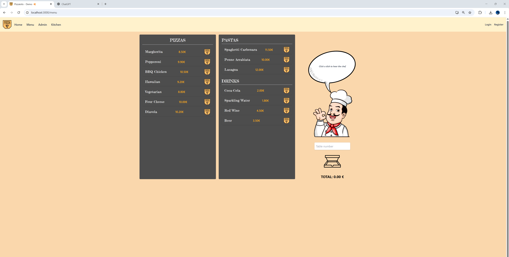
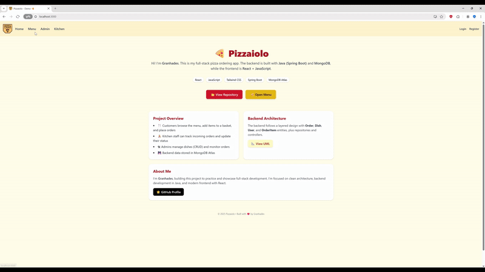
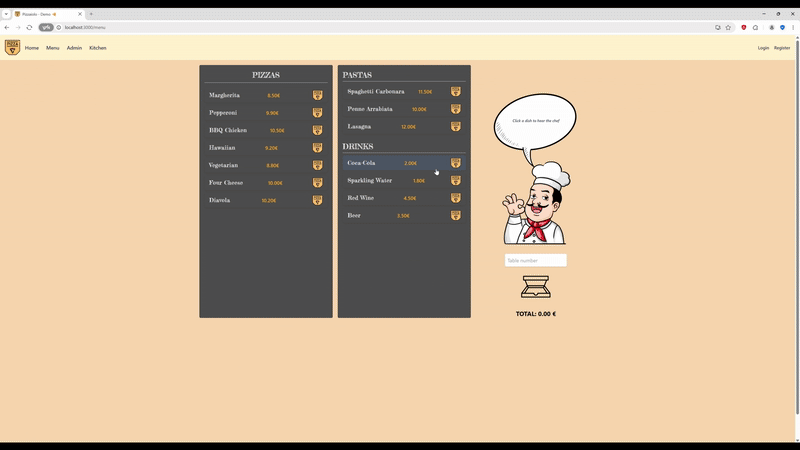
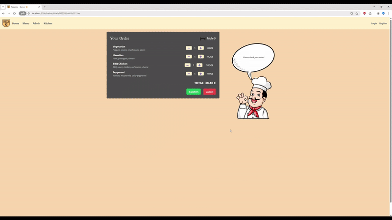
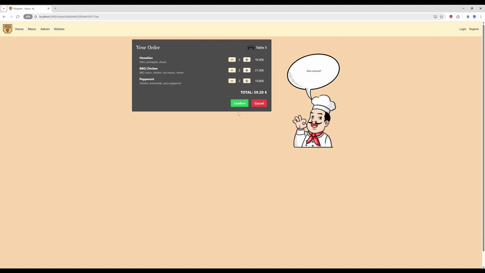
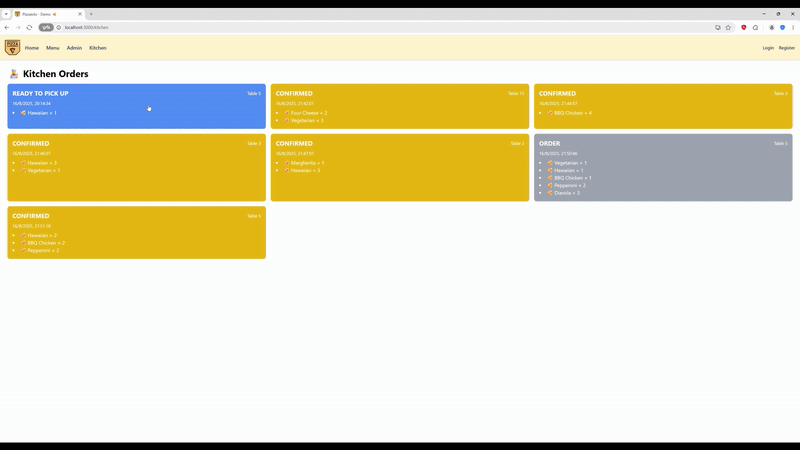
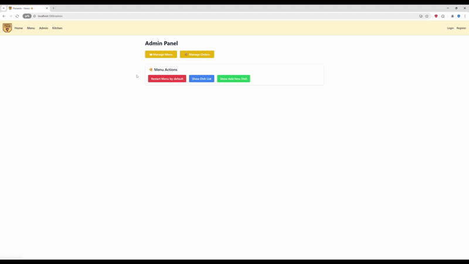
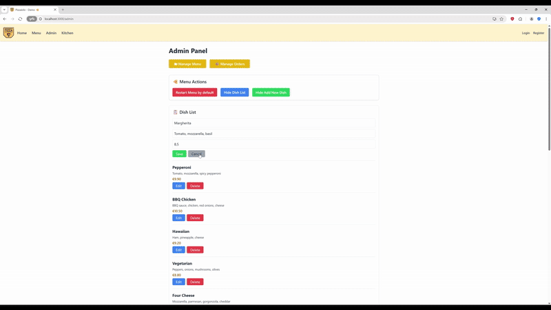
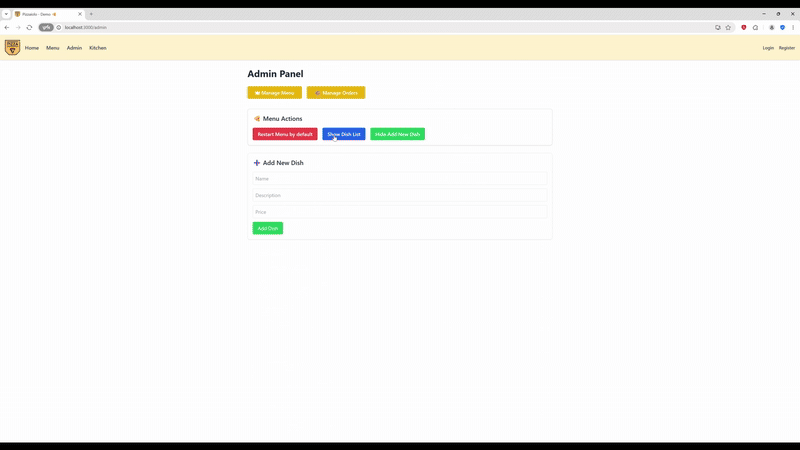

# 🍕 Pizzaiolo - Full Stack Pizza Ordering App

This project is a full-stack web application for ordering pizzas at a restaurant.
Customers can browse the menu, place orders, and track their status in real-time.
Admins can manage dishes and monitor orders from the kitchen.

Built with **React + Axios + TailwindCSS** on the frontend, and **Spring Boot (Java) + MongoDB** on the backend.

## 📑 Table of Contents
- [🛠 Tech Stack](#-tech-stack)
- [📸 Preview](#-preview)
- [🎥 Features](#-features)
- [🚀 How to Run](#-how-to-run)
- [📌 Future Improvements](#-future-improvements)
- [🛠 Backend Architecture](#-backend-architecture)
- [📐 Backend UML Diagram](#-backend-uml-diagram)
- [📷 Disclaimer & Image Credits](#-disclaimer--image-credits)

---

## 🛠 Tech Stack

**Frontend**  
- React (Vite)  
- Axios (API requests)  
- TailwindCSS (styling)  

**Backend**  
- Java + Spring Boot  
- MongoDB Atlas  

---

## 📸 Preview

### Main Page


---

## 🎥 Features

### 1. Login / Init


### 2. Browse Menu


### 3. Check Order


### 4. User Validation


### 5. Confirm Order


### 6. Kitchen Dashboard


### 7. Admin Orders


### 8. Admin Add Item


### 9. Admin Restart


---

## How to Run ##

1. Clone this repository.  
2. Start the backend:  
   ```bash
   cd backend
   ./mvnw spring-boot:run
3. Start the frontend:
    cd restaurant-frontend
    npm install
    npm run dev
4. Open localhost (http://localhost:5173)


## 📌 Future Improvements

- Implement user authentication with JWT tokens  
- Add profile page for order history and personalization  
- Improve responsive design for mobile devices  
- Enhance admin panel with order search & filtering  
- Replace placeholder images with original assets  
- Integrate a secure payment system  
- Add QR code scanning by table number for faster ordering  

## 🛠 Backend Architecture

The backend is built with **Java + Spring Boot + MongoDB** and follows the next architecture:

- **Entities/Models**: `User`, `Dish`, `Order`, `OrderItem`
- **Repositories**: `UserRepository`, `DishRepository`, `OrderRepository`
- **Controllers**: `UserController`, `DishController`, `OrderController`
- **Utilities/Tests**: `Status`, `DataSeeder`, JUnit tests

## 📐 Backend UML Diagram

Here’s the architecture of the backend:


### 🎨 Color Legend
- 🟨 Entities/Models
- 🟩 Repositories
- 🟦 Controllers
- ⚪ Utilities / Enums / Tests

## 📷 Disclaimer & Image Credits

This project uses placeholder images and icons from free repositories for demonstration purposes only.  
They will be replaced with custom or licensed assets in production.  

**Assets used:**
- [Pizza icon](https://www.flaticon.es/icono-gratis/boton-x_458594?term=x&page=1&position=3&origin=search&related_id=458594) – Flaticon  
- [Speech bubble](https://pngtree.com/freepng/oval-comics-with-speech-bubbles_4492754.html) – PNGTree  
- [Pizzaiolo (Chef)](https://es.pngtree.com/freepng/cartoon-head-chef_9042646.html) – PNGTree  
- [Pizza box icon](https://www.flaticon.es/iconos-gratis/caja-de-pizza) created by **Ali Syaifullah** – Flaticon  
- [Pizza (full box)](https://www.flaticon.es/iconos-gratis/pizza) created by **Smashicons** – Flaticon